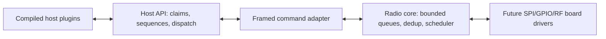

# NOVA-LINK System Architecture

The current implementation is a portable software core. ESP32-S3 and CC1352R
are the intended deployment targets; their board drivers are not implemented yet.
This page describes the installed SDK. The [extended prototype](../experimental/extended/README.md)
has a separate API and wire format; the DMX level library is independent of both.

## Components

| Component | Portable module | Responsibility |
|---|---|---|
| Plugin host | `host.c` | Lifecycle, payload send/receive, callbacks, logging |
| Zone manager | `zones.c` | Local exclusive/read-only claims and zone interest |
| Packet codec | `fragment.c` | Explicit wire serialization, 3/3/2 header split |
| Transport | `transport.c` | SYNC/LEN/command framing and incremental parsing |
| Stream tracker | `stream.c` | Per-origin/zone wrap-aware duplicate/stale rejection |
| Buffering | `queue.c`, `radio.c` | Per-zone TX queues, shared RX with optional coalescing, in-process backpressure |
| Scheduler | `scheduler.c` | Monotonic timed data rounds and optional metadata slots |
| Platform adapter | To be implemented | Device I/O, shared RF timing, PHY pacing/completion |

## Data flow

**TX:** A registered plugin with write access supplies up to 100 bytes. The host
adds its origin, zone, flags, and the next per-zone sequence. Its send callback
encodes a PUSH command. The radio validates and queues the fragment, and the
scheduler exposes a due zone window. The PHY adapter peeks, submits, then takes
ownership of TX data. Local acceptance is not an over-the-air acknowledgment.

**RX:** The PHY adapter decodes valid RF bytes and submits a fragment to the
radio. The stream tracker rejects duplicate/stale arrivals before RX queueing;
a full queue leaves the sequence available for retry. INT_READY can reflect
`nl_radio_ready()`. A PULL prepares a `D0` fragment response and an adapter-local
revision token. The adapter commits removal after ownership transfer; aborted
handoffs retain the RX head, and stale tokens preserve replacements. The host's
own tracker deduplicates and dispatches to interested plugins, rejecting
fragments bearing its own origin.

## Scheduling and metadata

Only subscribed data zones participate. The current policy visits them in
ascending order, then inserts one metadata slot if zone 0 has queued TX or a
management listen request. Zone 0 cannot be claimed and is globally accessible
to active plugins. A burst may extend one slot by at most one base slot; it does
not bypass other active zones.

The clock, common RF schedule, actual channel/frequency table, airtime budget,
and dual-band arbitration belong to future protocol/board work. The original
suggestion that four full zones plus metadata meet the latency target is not
validated: it depends on PHY rate, overhead, timing, and number of transmissions.

See [protocol decisions](Protocol_Decisions.md),
[development guide](Development.md), and [roadmap](Development_Roadmap.md).
